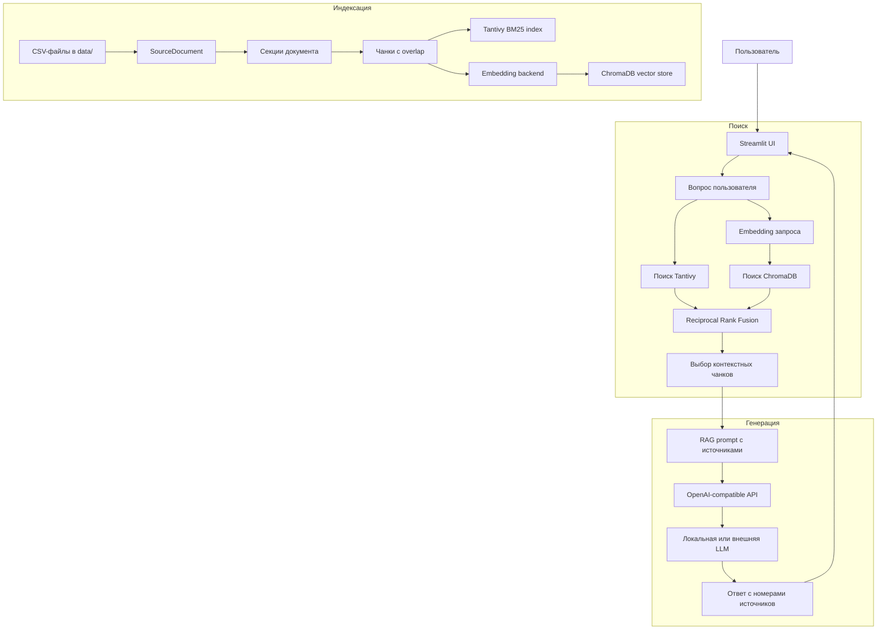

# Sci-Steel Assistant

Локальный RAG-ассистент для поиска и ответов по металлургическим статьям и патентам.

## Quick run

```bash
python -m venv venv
source venv/bin/activate  # Windows PowerShell: .\venv\Scripts\Activate.ps1
pip install -r requirements.txt
pip install -U "huggingface_hub[cli]"
hf download BAAI/bge-m3 --local-dir models/bge-m3
cp .env.example .env
streamlit run streamlit_app.py
```

Перед запуском чата поднимите LM Studio Local Server (enable_thinking = off) или настройте внешний OpenAI-compatible endpoint в `.env`.

Приложение открывается по адресу:

```text
http://127.0.0.1:8501
```

## Возможности

- Streamlit UI.
- Полнотекстовый BM25-поиск через Tantivy.
- Векторный поиск через ChromaDB.
- Локальные или внешние embeddings.
- Локальная или внешняя OpenAI-compatible LLM.

## Архитектура



## Требования

- Python 3.12.
- LM Studio Local Server или внешний OpenAI-compatible LLM endpoint.
- CSV-корпус в `data/`.
- `models/bge-m3`, внешние embeddings или hashing fallback.

## Установка

Создайте и активируйте виртуальное окружение:

```bash
python -m venv venv
source venv/bin/activate
```

Windows PowerShell:

```powershell
.\venv\Scripts\Activate.ps1
```

Установите зависимости:

```bash
pip install -r requirements.txt
```

## Скачивание моделей

Установите Hugging Face CLI:

```bash
pip install -U "huggingface_hub[cli]"
```

Скачайте локальную embedding-модель:

```bash
hf download BAAI/bge-m3 --local-dir models/bge-m3
```

LLM можно загрузить в LM Studio или подключить через внешний OpenAI-compatible API.

Для `qwen/qwen3.5-9b` и похожих reasoning-моделей Qwen рекомендуется отключить `enable_thinking` / thinking mode. Это заметно снижает задержку ответа, потому что модель перестает тратить большую часть генерации на скрытое рассуждение до появления финального `content`.

```text
enable_thinking: off
```

## Конфигурация

Скопируйте `.env.example` в `.env` и настройте локальные endpoints/секреты.

В sidebar Streamlit есть отдельные переключатели:

- LLM для ответа: локальная LM Studio или внешний OpenAI-compatible endpoint.
- Embeddings для ChromaDB: локальная `bge-m3`, внешний OpenAI-compatible endpoint или hashing fallback.

После смены embedding backend или модели нужно переиндексировать данные.

## Запуск

Сначала запустите LM Studio Local Server. По умолчанию приложение ожидает:

```text
http://127.0.0.1:1234/v1
```

Запустите Streamlit:

```bash
streamlit run streamlit_app.py
```

Проект содержит `.streamlit/config.toml`:

```toml
[server]
address = "127.0.0.1"
fileWatcherType = "none"
```

`fileWatcherType = "none"` отключает шумные импорты Streamlit watcher из vision-модулей `transformers`.

## Индексация данных

Используйте кнопку в sidebar:

```text
Переиндексировать CSV
```

Она пересобирает:

- `tantivy_index/`
- `chroma_db/`

Во время индексации UI показывает:

- текущий этап;
- число документов;
- число чанков;
- прогресс записи embeddings в ChromaDB;
- текущий файл и source id.

После смены embedding-модели или `EMBEDDING_BACKEND` нужно переиндексировать данные.

## Деление на чанки

Деление на чанки реализовано в `app/indexing.py`.

Каждая строка CSV превращается в `SourceDocument`.

Секции статей:

- `title`
- `publication`
- `keywords`
- `abstract`
- `research_areas`

Секции патентов:

- `title`
- `classification_ipcr`
- `abstract`
- `description`
- `claims`

Параметры по умолчанию:

```text
max_chars = 1800
overlap = 200
```

Метод:

1. Пустые секции пропускаются.
2. Текст нормализуется: удаляются переносы строк и повторяющиеся пробелы.
3. Каждая секция делится на чанки отдельно.
4. Если секция помещается в `max_chars`, она становится одним чанком.
5. Длинные секции режутся по границам предложений.
6. Если предложения выделить не удалось, fallback режет текст по длине и старается закончить на пробеле.
7. Новые чанки включают до `overlap` символов из предыдущего чанка.
8. Каждый чанк хранит метаданные: файл, тип источника, source id, название, секцию, год, позиции символов и номер чанка.

Формат id чанка:

```text
{source_type}:{source_id}:{section}:{chunk_number}
```

## Разделы UI

- `Чат` - RAG-чат с источниками.
- `Поиск` - гибридный поиск без генерации LLM.
- `Ключевые слова` - keyword-only поиск.
- `Состояние` - диагностика текущих настроек.

## Решение проблем

Если индексация долго стоит на `write_chroma`, приложение считает и записывает embedding-векторы. Увеличьте или уменьшите `EMBEDDING_BATCH_SIZE` в зависимости от доступной RAM.

Если LLM отвечает медленно, сначала отключите `enable_thinking` в LM Studio и уменьшите `RAG_MAX_TOKENS`.

Если ChromaDB сообщает об ошибке размерности embedding, удалите/пересоберите `chroma_db/` через переиндексацию CSV.
